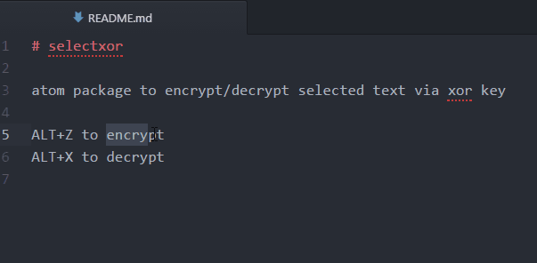

# selectxor

atom package to encrypt/decrypt selected text using xor key

#Usage

* Select text and ALT+Z to encrypt
* Select text and ALT+X to decrypt

The default key is 'selectxor' but you can change it in the package settings.
